# UI 디자인 피드백 — AI 슬롭 탈출 가이드

> 작성일: 2026-05-29
> 검토 대상: 홈 / About / 테스트 모드 선택 / 결과 / 8타입 목록 / 타입 상세
> 검토 방식: Playwright MCP로 Desktop(1440×900) · Mobile(390×844) 풀페이지 캡처 후 분석
> 평가 기준: WCAG AA, Apple HIG, Material Design, ui-ux-pro-max 룰셋

---

## TL;DR — 지금 디자인이 "AI 같은" 이유

1. **모든 페이지가 보라–핑크–블루 풀스크린 그라데이션** — 2023년 이후 AI 생성 랜딩의 1번 시그니처. 상품(컬러칩)이 배경에 잡아먹힘.
2. **글래스모피즘 카드 남용** — 그라데이션 위에 frosted 카드, 그 위에 또 카드. 깊이 의미 없이 3겹.
3. **본문이 전부 가운데 정렬** — 히어로뿐 아니라 About 긴 문단까지. 가독성 ↓.
4. **흰 글씨 × 채도 높은 핑크 배경** — 명도 대비 미달(4.5:1 미충족 구간 다수).
5. **체크마크 4줄 피처 리스트 + 진하게 강조된 거대 한글 헤드라인** — 전형적 AI 랜딩 템플릿.
6. **결과 페이지만 톤이 따로 놂** — 홈/About/테스트는 다크 글래스, Results는 라이트 플랫. 한 제품이 두 디자인 시스템.
7. **시즌 카드/8타입 카드가 비슷한 채도의 파스텔로 일렬 나열** — 위계 없음, 어떤 게 중요한지 모름.

핵심 처방: **그라데이션을 90% 걷어내고**, **컬러칩(=제품의 본체)을 비주얼 히어로로** 끌어올리고, **타이포·여백·정렬로만 위계를 만든다**.

---

## 1. 페이지별 캡처 + 진단

### 1.1 홈 `/`

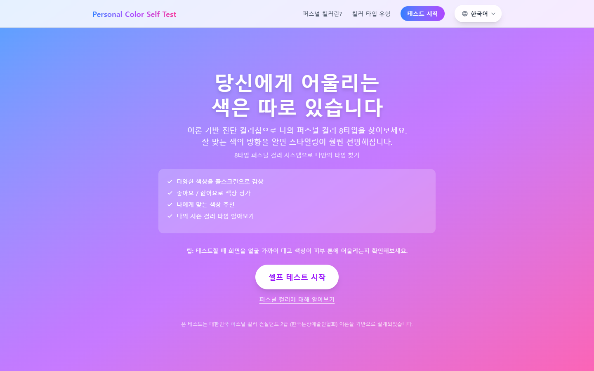
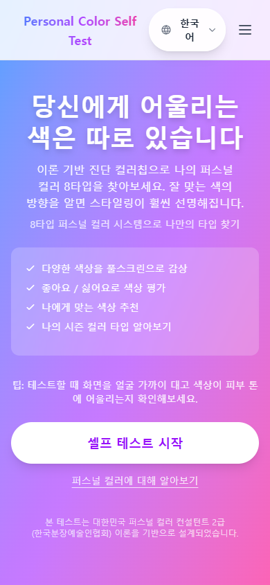

| 문제 | 근거 | 위반 룰 |
|---|---|---|
| 풀스크린 보라 그라데이션이 시선을 독점 | 컬러 진단 서비스인데 정작 컬러 샘플이 0개 노출 | `style-match`, `color-not-decorative-only` |
| 흰색 본문 × 핫핑크 영역 대비 부족 | 모바일 캡처 하단 "본 테스트는 대한민국 퍼스널 컬러 컨설턴트 2급…" 거의 안 읽힘 | `color-contrast`, `contrast-readability` |
| 가운데 정렬 체크마크 4줄 | "다양한 색상을 풀스크린으로 감상 / 좋아요·싫어요로 색상 평가 …" — AI 랜딩 클리셰 | `humanizer`(rule of three/four), `visual-hierarchy` |
| CTA가 반투명 흰 알약 | 그라데이션과 동화돼서 일순간 안 보임. 프라이머리 CTA는 단단해야 함 | `primary-action`, `state-clarity` |
| 헤더가 그라데이션 위에 떠 있음 | "Personal Color Self Test" 브랜드명이 라이트 퍼플로 보라 배경에 묻힘 | `color-accessible-pairs` |

### 1.2 About `/about`

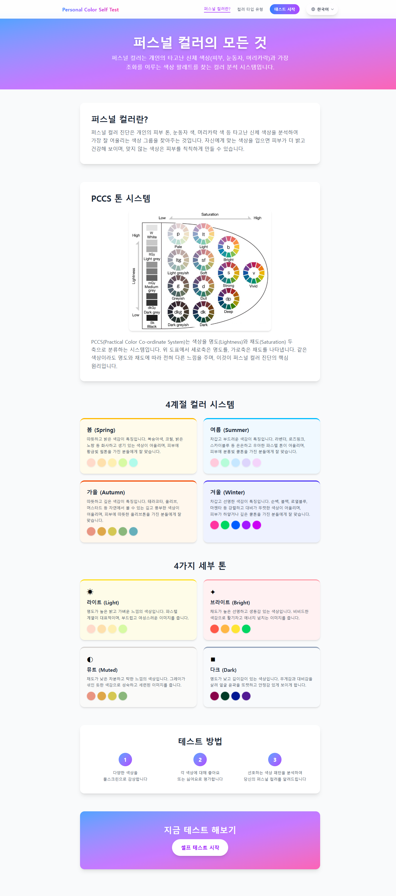
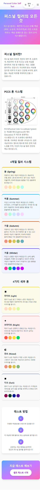

| 문제 | 근거 |
|---|---|
| 긴 설명 문단이 중앙 정렬 | 한국어 본문 가운데 정렬은 줄바꿈마다 시선 점프 발생. `line-length-control` 위반 |
| 4계절 카드와 4톤 카드가 비슷한 채도의 파스텔 박스 4×2 | 정보 위계 무. 봄/여름/가을/겨울이 같은 가중치, 라이트/브라이트/뮤트/다크도 같은 가중치 |
| PCCS 톤 시스템이 외부 차트 이미지(스타일 이질) | 나머지 UI는 글래스/플랫인데 차트만 따로 놂. `icon-style-consistent` 위반 |
| 하단 "테스트 방법" 1-2-3 — 다시 그라데이션 박스 | 모든 섹션이 "박스 안에 박스" 패턴. 박스 인플레이션 |

### 1.3 테스트 모드 선택 `/test`

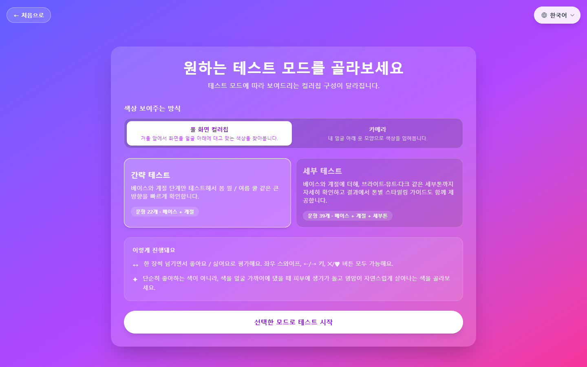
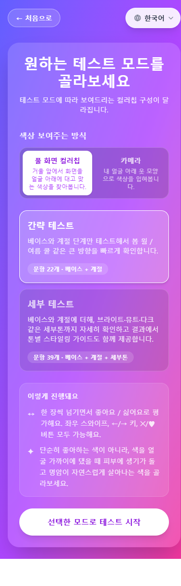

| 문제 | 근거 |
|---|---|
| 그라데이션 위에 글래스 카드 × 다시 그 안에 글래스 카드 | 깊이 3겹. 어디까지가 클릭 가능한지 모호 |
| "간략 테스트"와 "세부 테스트" 카드가 동일 weight | 사용자에게 권장값이 없음. `primary-action` 위반 |
| "색상 보여주는 방식 → 풀 화면 컬러칩 / 카메라" 토글이 작고 라벨이 약함 | 모드 전환 UI가 본 컨텐츠보다 작아 발견율 낮음 |
| "이렇게 진행돼요" 안내가 또 박스 안 | 같은 시각 레이어가 너무 많이 반복 |

### 1.4 결과 `/results`

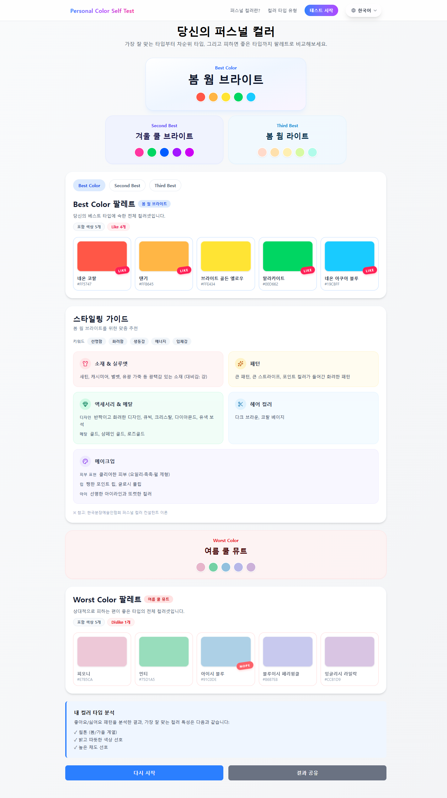
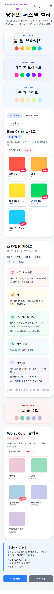

| 문제 | 근거 |
|---|---|
| 톤이 갑자기 라이트 플랫으로 바뀜 | 홈/About/테스트와 디자인 시스템 단절. `consistency`, `motion-consistency` 정신 위반 |
| Best / 2nd / 3rd가 가로 폭은 다르지만 동일 카드 스타일 | "내 베스트 컬러"가 압도적으로 도드라지지 않음. 결과 페이지의 핵심 정보 |
| 스타일링 가이드 탭(스타일링/색조합/패션/뷰티/감정)이 본 결과보다 시선을 가져감 | 정보 위계 역전 |
| Worst Color 섹션이 Best와 거의 동등한 면적 | "내가 어울리지 않는 색"은 보조 정보인데 동등 가중 |
| 컬러칩이 작고 둥근 모서리 + 흰 카드에 들어가 있음 | 칩 자체가 히어로여야 하는데 카드 안 컨텐츠로 강등 |

### 1.5 8타입 목록 `/types`

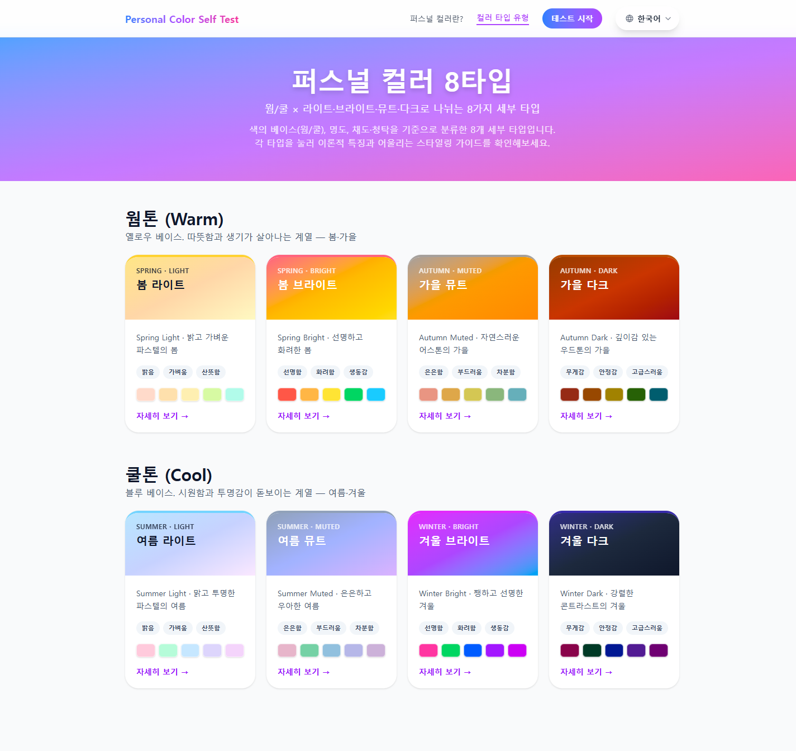
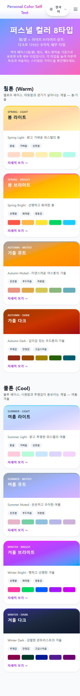

| 문제 | 근거 |
|---|---|
| 8개 타입 카드가 채도만 다른 동일 템플릿 | 봄/여름/가을/겨울 그룹핑이 약함. 색만 다른 동일 카드 8개 |
| 카드 상단의 컬러 그래디언트 바가 카드와 분리감 부족 | 어떤 타입인지 즉시 인지 안 됨 |
| 큰 보라 히어로가 또 등장 | 모든 페이지 톱이 그라데이션, 진입 단조로움 |

### 1.6 타입 상세 `/types/spring-bright`

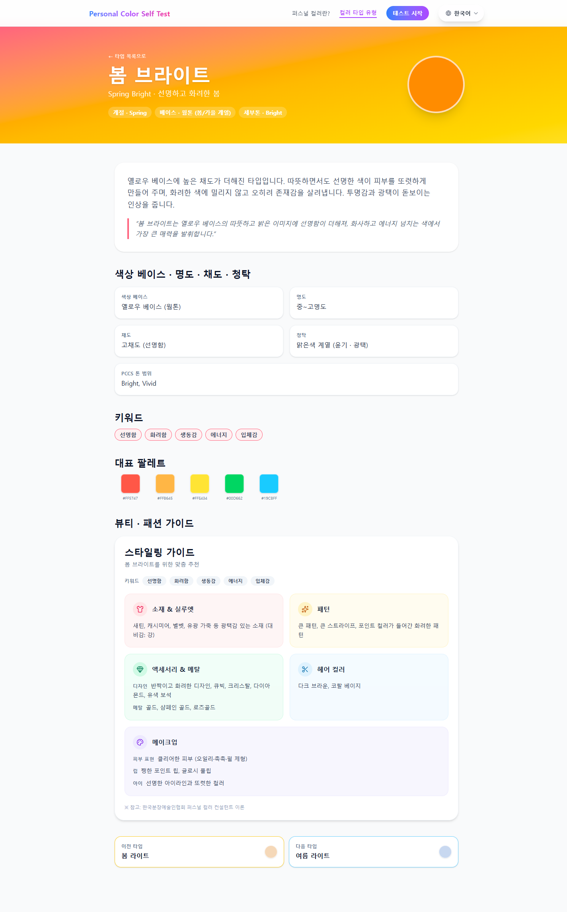

| 문제 | 근거 |
|---|---|
| 큰 오렌지 원 + "봄 브라이트" 헤더 — 컴포넌트 형태가 갑자기 일러스트레이션틱 | 다른 페이지엔 없는 표현. `consistency` 위반 |
| 키워드 칩(선명한/화사한/생동감/에너지/Bright Vivid) 위치가 빈약 | 정작 이 타입의 정체성인 키워드인데 회색 칩으로 약함 |
| "스타일링 가이드" 카드들이 또 동일 스타일 박스 반복 | About·결과와 카드 컴포넌트가 거의 똑같음 |

---

## 2. AI 슬롭 시그널 정리 (왜 그런 느낌이 나는가)

| # | 시그널 | 어디서 나오나 |
|---|---|---|
| 1 | 풀스크린 보라–핑크 그라데이션 | 홈/About/테스트/8타입 모두 |
| 2 | 글래스모피즘 카드 | 홈, 테스트, About 상단 |
| 3 | 가운데 정렬 긴 본문 | About 거의 전체, 홈 히어로 하단 |
| 4 | 체크마크 4줄 피처 리스트 | 홈 히어로 |
| 5 | "박스 안에 박스 안에 박스" | 테스트 페이지 전체 |
| 6 | 동일 가중치의 파스텔 카드 그리드 | About 시즌·톤 카드, 8타입 카드 |
| 7 | 두 가지 디자인 시스템 충돌 | (다크 글래스) ↔ (라이트 플랫 Results) |
| 8 | 강한 그라디언트 알약형 CTA | 홈, 8타입, 타입 상세 |
| 9 | 외부 차트 이미지로 PCCS 설명 | About |
| 10 | "Personal Color Self Test" 로고가 그라데이션에 동화 | 모든 페이지 헤더 |

위 10개를 동시에 만족하면 "AI가 뽑아낸 SaaS 랜딩" 인상이 확정된다. 본 프로젝트는 6번 7번을 빼고 전부 해당.

---

## 3. 방향 제안 — "에디토리얼 갤러리" 컨셉

**한 줄 컨셉**: 컬러를 다루는 도구는 본인이 색을 입지 말아야 한다. 미술관 흰 벽처럼 비워두고, 컬러칩이 작품이 되도록.

### 3.1 디자인 토큰 (제안)

```
배경:        #FAFAF7 (오프 화이트) — 종이 느낌
표면:        #FFFFFF (카드)
헤어라인:    #E6E4DE (1px 경계선, shadow 대신)
텍스트 1:    #14110F (제목, 거의 검정)
텍스트 2:    #555049 (본문)
텍스트 3:    #8A857C (캡션)
액센트:      #1F1B16 (CTA 배경, 거의 검정)
액센트 텍스트:#FAFAF7

그라데이션은 "히어로 풀배경"으로 쓰지 않는다.
사용처: ① 컬러칩 미리보기의 가로 스트립 ② 결과 페이지의 상단 진단 결과 박스 1군데.
```

### 3.2 타이포그래피 (제안)

| 역할 | 폰트 | 비고 |
|---|---|---|
| 디스플레이/제목 | `Noto Serif KR` 700 / `Instrument Serif` (영문) | 에디토리얼 느낌, 키 컬러 없이도 톤 형성 |
| 본문 | `Pretendard` 400/500 | 현행 유지 |
| 모노/숫자 | `JetBrains Mono` tabular | 시즌 코드, 색상 코드 표기 |

스케일: `12 / 14 / 16 / 18 / 22 / 28 / 40 / 64` — 본문 16px 고정, 모바일 자동축소 금지.

### 3.3 레이아웃 원칙

- **본문 좌측 정렬**(Hero 한 줄 헤드라인만 가운데 허용)
- 데스크톱 콘텐츠 폭 `max-w-3xl` (768px) — 긴 줄 방지
- 섹션 간 여백 `96px ↔ 128px`, 카드 내부 `24/32px`
- 카드 그림자/블러 제거 → 1px 헤어라인으로 분리

### 3.4 컴포넌트 처방

| 컴포넌트 | 지금 | 바뀌어야 할 모습 |
|---|---|---|
| 홈 히어로 | 보라 그라디언트 + 흰 헤드라인 + 체크마크 4줄 | 오프화이트 배경, 좌측 정렬 큰 한글 세리프 헤드라인 1줄 + 부제 1줄. 오른쪽엔 4×3 컬러칩 미리보기 그리드(실 데이터). CTA는 검정 풀형 |
| Header | 라이트 퍼플 로고가 그라디언트에 묻힘 | 솔리드 배경 + 검정 로고. 언어 토글은 텍스트 링크 또는 작은 드롭다운 |
| About 시즌 카드 4개 | 비슷한 파스텔 4박스 | "봄"이 화면 가득 차는 큰 시즌 섹션으로, 스크롤로 시즌이 바뀌는 1-Up 레이아웃. 각 시즌 안에 칩 15개를 풀폭 스트립으로 |
| 8타입 그리드 | 채도만 다른 카드 8개 | 시즌별 2개 묶음을 헤어라인으로 그룹핑. 카드 헤더는 큰 컬러 띠(높이 80px+)로 그 타입의 시그니처 4색을 보여줌 |
| 결과 Best | 카드 1개로 작게 | 풀폭 컬러칩 스트립이 화면 상단을 가로지름 + 시즌 명을 세리프 큰 글자로 |
| 결과 2nd / 3rd | Best와 비슷한 크기 | Best의 30~40% 크기, 좌측 정렬 단일 행 |
| 결과 Worst | 별도 큰 섹션 | 페이지 맨 아래로 보내고 접힘(아코디언) 처리 — 사용자가 알고 싶을 때만 |
| 테스트 모드 카드 | 동일 가중 2개 | "세부 테스트(권장)" 배지 + 1.4배 크기. 간략은 보조 텍스트 링크 |
| CTA | 반투명 알약 | 검정 솔리드 직사각형(둥글기 8px), 패딩 큼. 한 화면 1개 |

### 3.5 색의 사용 원칙

- **브랜드 색이 컨텐츠 색을 이기지 않는다.** UI 자체는 무채색(흰/오프화이트/검정).
- 시즌별 색 4×15=180개가 실제 "브랜드". UI 색은 이를 위한 액자.
- 강조가 필요할 땐 그라디언트가 아닌 **단일 채도 컬러 텍스트**(예: 봄 브라이트 → `#E64A19` 헤더 1단어만)로.

### 3.6 모션

- 페이지 전환 fade 200ms 이하, 컬러칩 등장은 stagger 30ms (`stagger-sequence`)
- 풀스크린 그라디언트 애니메이션 / 떠다니는 블러 → 전부 제거
- `prefers-reduced-motion` 지원 (`reduced-motion`)

---

## 4. 우선순위 액션 리스트

### 🔴 P0 — 인상을 바꾸는 가장 큰 레버 (1~2일)

1. **전역 배경을 오프화이트로 변경**. 그라데이션 클래스(`bg-gradient-...`)를 홈/About/테스트/8타입에서 제거.
2. **헤더를 솔리드 배경 + 검정 로고**로 변경, 그라데이션 위에 떠다니지 않게.
3. **흰 글씨 × 핫핑크** 조합 전부 검정/딥차콜로 교체 — `color-contrast` 4.5:1 통과시키기.
4. **CTA 통일**: 검정 솔리드 1종, 텍스트 링크 1종. 반투명 알약 폐기.

### 🟠 P1 — 정보 위계 (2~3일)

5. **홈 히어로 재구성**: 헤드라인 1줄 + 부제 1줄 + 실제 컬러칩 12~16개 미리보기 + CTA. 체크마크 4줄 삭제.
6. **결과 페이지 Best 강조**: Best 카드를 풀폭 컬러 스트립으로, 2nd/3rd는 1/3 크기로 축소.
7. **Worst Color 섹션 접기** (아코디언, 기본 닫힘).
8. **테스트 모드 "세부 테스트" 권장 배지 + 사이즈 차등화**.

### 🟡 P2 — 일관성 (3~5일)

9. **About 4계절 섹션을 1-Up 풀폭 시즌 섹션으로 재구성**.
10. **8타입 카드를 시즌별 2개씩 그룹핑**, 헤더 컬러 띠 두껍게.
11. **PCCS 톤 차트를 자체 SVG로 재제작** — 외부 이미지 스타일 단절 제거.
12. **타이포 도입**: Noto Serif KR(또는 Instrument Serif + Noto Serif KR)을 디스플레이에.

### 🟢 P3 — 폴리시

13. 컬러칩 hover/focus 상태 정의(`focus-states`, `state-clarity`).
14. 모바일 본문 좌측 정렬로 변경(현재 중앙).
15. 결과 페이지 공유 OG 이미지 — 컬러 스트립 기반 자동 생성.
16. `prefers-reduced-motion` 처리.

---

## 5. 비포 / 애프터 한 줄 요약

| | Before | After |
|---|---|---|
| 인상 | "AI로 뽑은 컬러풀한 SaaS" | "퍼스널 컬러 컨설턴트의 워크북" |
| 시선 | 보라 그라데이션 | 실제 컬러칩 |
| 위계 | 모두 같은 박스 | 검정 헤드라인 + 1개 강조 컬러 |
| 톤 | 페이지마다 다름 | 한 시스템 |
| 가독성 | 흰×핫핑크 (대비 미달) | 딥차콜×오프화이트 (AA 통과) |

---

## 6. 참고 (스킬 기반 룰 매핑)

핵심 위반 룰(ui-ux-pro-max Quick Reference 기준):

- `color-contrast`, `color-accessible-pairs` — 흰 글씨×핫핑크
- `style-match`, `consistency` — 페이지별 디자인 시스템 충돌
- `primary-action` — 동일 가중 CTA / 동일 가중 카드
- `visual-hierarchy`, `whitespace-balance` — 박스 안에 박스
- `icon-style-consistent` — PCCS 외부 이미지
- `humanizer` — 체크마크 4줄 등 AI 글쓰기 신호와 동형의 시각적 패턴

— 끝.
